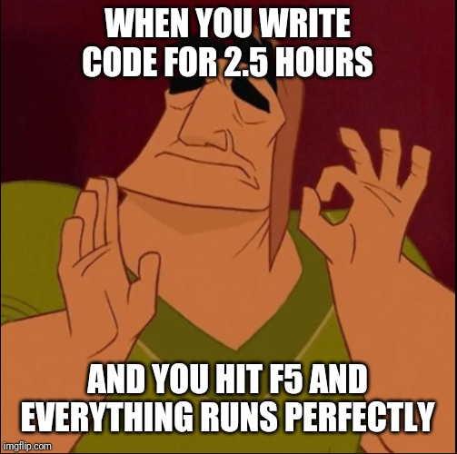

<h1 align="center">
  
   
  Cross Architecture  
  Cross-Tools Documentation by Erich Domme
</h1>

This repository serves to document all "Cross-Tools", how they work, what is the idea behind them and how they were implemented! The project was developed during an internship at Cross Architecture Aachen as part of the Master in Construction and Robotics at RWTH Aachen University. The aim was to implement a set of tools that the entire Cross Architecture team could use to simplify and in many cases automate repetitive, tedious and complicated tasks in their daily work with Revit. These quality of life tools were constantly tested and adapted to the working conditions. 

<!-- LINKS -->

  <h4>
    <a href="https://www.pinterest.de/cross_architecture/">
      Pinterest
    </a>
     | 
    <a href="https://www.facebook.com/CROSSArchitecture/">
      Facebook
    </a>
     | 
    <a href="https://www.linkedin.com/company/cross-architecture/mycompany/">
      LinkedIn
    </a>
     | 
    <a href="https://www.instagram.com/cross_architecture/">
      Instagram
    </a>
     | 
    <a href="https://www.cross-architecture.net/">
      Homepage
    </a>
  </h4>

<!-- TABLE OF CONTENTS -->

  
Table of Contents

  <ol>
    <li>
      <a href="#about-the-project">About The Project</a>
      <ul>
        <li><a href="#built-with">Built With</a></li>
      </ul>
    </li>
    <li>
      <a href="#getting-started">Getting Started</a>
      <ul>
        <li><a href="#prerequisites">Prerequisites</a></li>
        <li><a href="#installation">Installation</a></li>
      </ul>
    </li>
    <li><a href="#usage">Usage</a></li>
    <li><a href="#roadmap">Roadmap</a></li>
    <li><a href="#contributing">Contributing</a></li>
    <li><a href="#license">License</a></li>
    <li><a href="#contact">Contact</a></li>
    <li><a href="#acknowledgments">Acknowledgments</a></li>
  </ol>

# Cross-Tools
> Outline a brief description of your project.
> Live demo [_here_](https://www.example.com). <!-- If you have the project hosted somewhere, include the link here. -->

## Table of Contents
* [General Info](#general-information)
* [Technologies Used](#technologies-used)
* [Features](#features)
* [Screenshots](#screenshots)
* [Setup](#setup)
* [Usage](#usage)
* [Project Status](#project-status)
* [Room for Improvement](#room-for-improvement)
* [Acknowledgements](#acknowledgements)
* [Contact](#contact)
<!-- * [License](#license) -->

## General Information
- Provide general information about your project here.
- What problem does it (intend to) solve?
- What is the purpose of your project?
- Why did you undertake it?
<!-- You don't have to answer all the questions - just the ones relevant to your project. -->

## Technologies Used
- Tech 1 - version 1.0
- Tech 2 - version 2.0
- Tech 3 - version 3.0

## Features
List the ready features here:
- Awesome feature 1
- Awesome feature 2
- Awesome feature 3

## Screenshots

<!-- If you have screenshots you'd like to share, include them here. -->

## Setup
What are the project requirements/dependencies? Where are they listed? A requirements.txt or a Pipfile.lock file perhaps? Where is it located?

Proceed to describe how to install / setup one's local environment / get started with the project.

## Usage
How does one go about using it?
Provide various use cases and code examples here.

`write-your-code-here`

## Project Status
Project is: _in progress_ / _complete_ / _no longer being worked on_. If you are no longer working on it, provide reasons why.

## Room for Improvement
Include areas you believe need improvement / could be improved. Also add TODOs for future development.

Room for improvement:
- Improvement to be done 1
- Improvement to be done 2

To do:
- Feature to be added 1
- Feature to be added 2

## Acknowledgements
Without these people and their projects, Cross-Tools would not have been possible:
- [Ehsan Iran-Nejad](https://github.com/eirannejad) with [pyRevit](https://github.com/eirannejad/pyRevit)
- [Erik Frits](https://github.com/ErikFrits) with [EF-Tools](https://github.com/ErikFrits/EF-Tools)
- [Gavin Crump, aussieBIMguru](https://github.com/aussieBIMguru) with [guRoo](https://github.com/aussieBIMguru/guRoo/tree/main/guRoo.tab/Tools.panel)
- [Marc Anton Dahmen](https://github.com/marcantondahmen) with [revitron](https://github.com/revitron/revitron)

## Contact
Created by [@Erich Domme](mailto:erich.domme@rwth-aachen.de) - feel free to contact me!

<!-- Optional -->
<!-- ## License -->
<!-- This project is open source and available under the [... License](). -->

<!-- You don't have to include all sections - just the one's relevant to your project -->